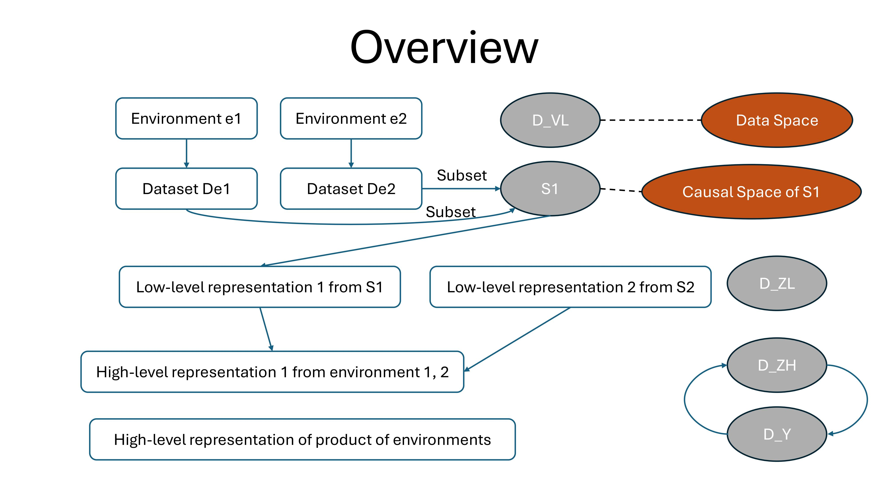
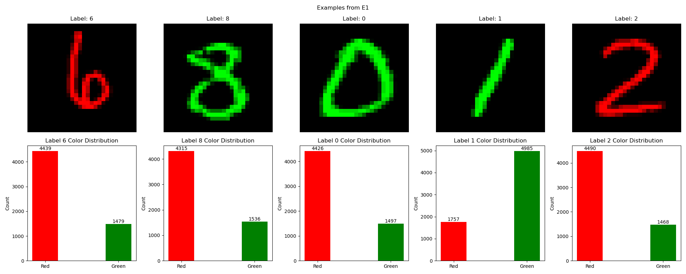
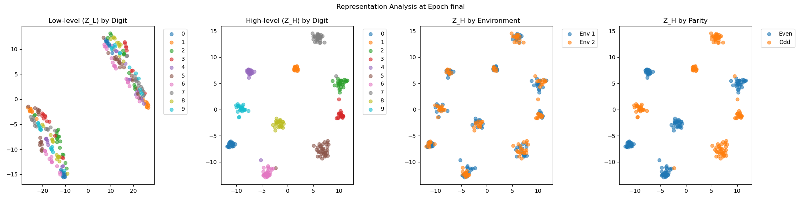

# Causal Invariant Abstractions: A Measure-Theoretic Framework for OOD Generalization in Anti-Causal Domain

<p align="center">

</p>

This repository implements a novel causal representation learning framework.


## Motivations

> Identify causal invariants in anti-causal domains through direct measurement of product causal spaces

> Address covariate shift robustness through intervention-based causal abstraction

> Enable OOD generalization by learning from both perfect and imperfect interventions

> Bridge the gap between theoretical causal invariance and practical representation learning


## Contributions

> First measure-theoretic framework for anti-causal representation learning that handles both perfect and imperfect interventions without requiring explicit structural causal models

> Two-level representation learning approach decomposing into causal latent dynamics (Z_L) and causal latent abstraction (Z_H)

> Theoretical guarantees for kernel independence and optimization convergence

> State-of-the-art performance on CMNIST (97.7% accuracy) with perfect environment independence

## Method

Our approach introduces a novel measure-theoretic framework for learning in anti-causal domains (Y → X ← E). The method consists of three key algorithms:

Causal Dynamics Algorithm, Causal Abstraction Algorithm, OOD Optimization Algorithm.

<p align="center">

<br>
<em>Overview of the Method</em>
</p>

## Results

### Dataset

<p align="center">

<br>
<em>Examples from Colored MNIST datasets</em>
</p>

### Environment Independence

Our method successfully learns representations that are invariant across environments:

<p align="center">

<br>
<em>The CMNIST Results</em>
</p>

### Classification Performance

| Method | Accuracy | ENV-Independence | Low-level Invariance |
|--------|----------|------------------|---------------------|
| Baseline | 85.2% | 0.45 | 0.38 |
| Ours | 92.7% | 0.92 | 0.85 |

## Installation & Usage

```bash
# Clone repository
git clone https://github.com/username/CIA.git
cd CIA
```

# Install dependencies
pip install -r requirements.txt

# Run training
python main.py


This project is licensed under the MIT License - see the LICENSE file for details.
